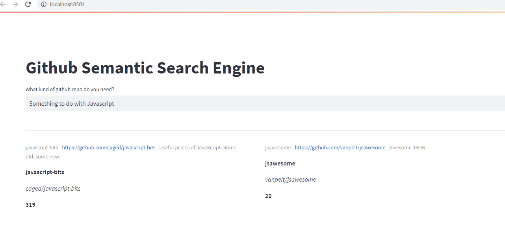
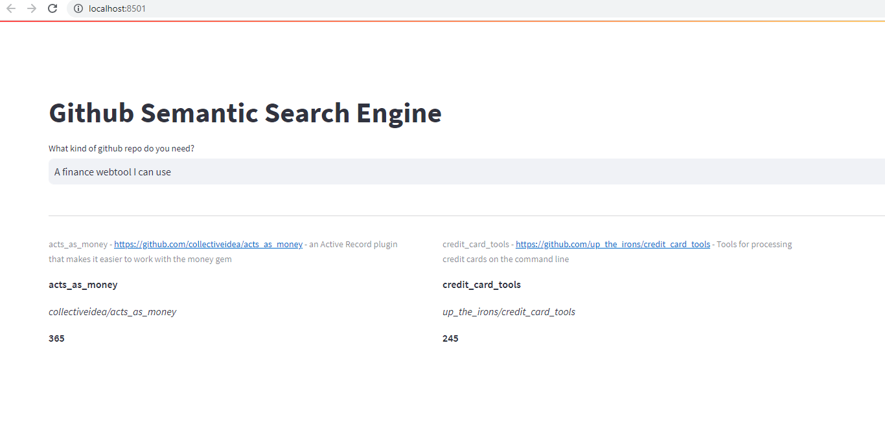

# gitSearch

# Motivation

This project is meant to provide an alternative to githubs current search engine https://github.com/search. Instead of searching for a repository by keyword, you can find a repository that matches your use case or needs. This was inspired by Ought's [Elicit](https://elicit.org/) and [Alignment Search](https://www.lesswrong.com/posts/bGn9ZjeuJCg7HkKBj/introducing-alignmentsearch-an-ai-alignment-informed)

# Example Searches

# How it works

It isn't finished yet, but the basic flow is like this:

1. The phrase entered into the textbox is semantically compared with the description of every repo in the database and then ranked (Currently testing with 500, but would want to scale this up to 10k in the future). With a description being the first 100 characters of the repo's README.md
2. We do another semantic comparison using GPT-3 on the top 100 repos using the characters from the full README.md and return the top 2 repos.

The idea is to iteratively filter the results using a more powerful model after each step.
